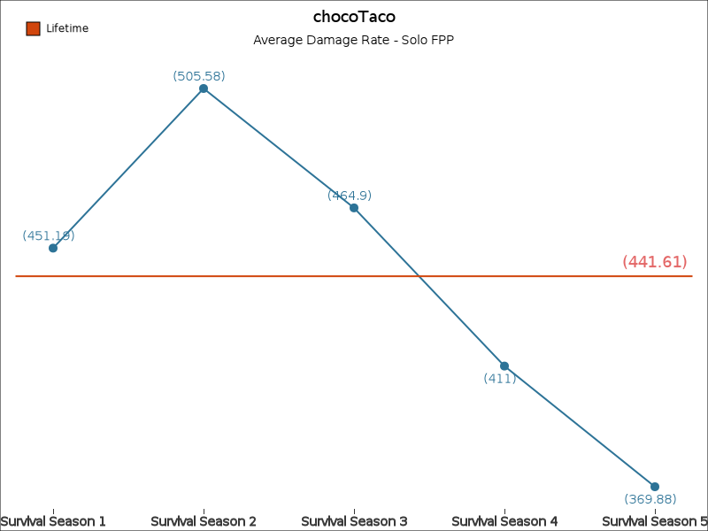
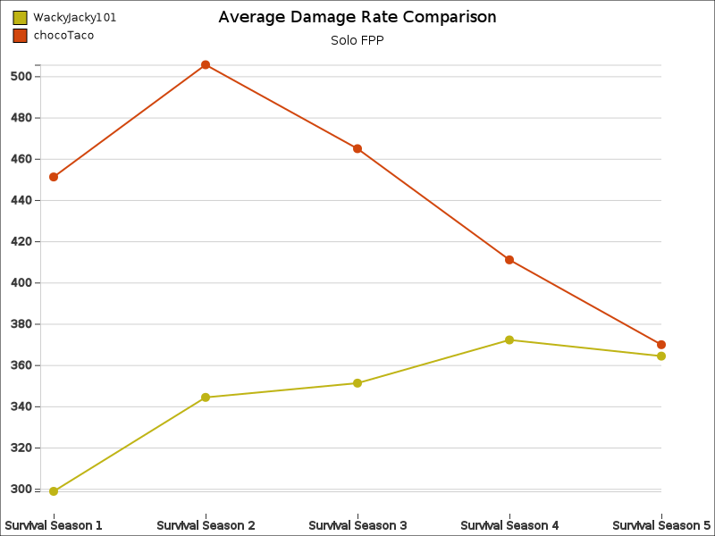

# spubg

Statistic based utility for PUBG powered by the [PUBG API](https://documentation.pubg.com/en/introduction.html)

## Motivation

`spubg` was built to fill in a gap of trending data across seasons, 
with the intention of either comparing yourself on different metrics between seasons and comparing yourself against your friends.

### Self Comparison Example

When comparing against yourself, the values for each metric and a lifetime value is displayed.

### Player Comparison Example

When comparing against others, only plot lines display the difference.

## Usage

### Prerequisites

1. You'll need an API token, store it in a `.env` file with a `PUBG_TOKEN=your_token_here` key.
2. Install the dependencies `npm i`
3. Build the binaries: `npm run build`

## Interact

There are multiple ways to interact with the underlying software, visit each document for more details:

* [cli](./docs/cli.md)
* [discord bot](./docs/discord.md)